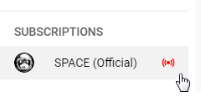

# youtube-upload-mail-reminder

Until Youtube has disabled their mail notification system, i've written this simple mail reminder script.
The script uses the XML feed from a channel, to check if a new video has been uploaded.

Requirements on Server/Webspace:

- Webserver like Apache2, nginx eg. with PHP
- SQL database (with activated mysqli module)
- Mail Transfer Agent (like ssmtp or sendmail)
- Cron

Installation

- Create a SQL user and a database
- Import the SQL dump into database
- Write the SQL connection details in file config.php
- Upload all files to server
- Open index.php in Browser to see the interface, where you can add accounts and favorite channels for any account
- Call with a cron the file feed_parser.php may every 10 minutes (As example: php -f /var/www/yt-reminder/feed_parser.php > /dev/null 2>&1) 

# How to get the Channel ID?

- Login into your Youtube account
- Go with the mouse pointer to your subscriptions
- As example: The channel from Space (Official) has the URL https://www.youtube.com/channel/UCIR_LPmEQ9QHR0yB2lxgaxQ
- Copy the URL somewhere and cut the part after channel/

<code>UCIR_LPmEQ9QHR0yB2lxgaxQ</code>

This mix of signs and numbers is the channel ID, which is required to paste in textfield 'Channel ID'.

- It's also possible to import the whole subscription list. How this works, is described in the interface.

---

Take note: After adding a new channel and run the script (feed_parser.php), a mail with many content will send.

After that only new videos was displayed in the notification mail.

---

Last changes

A button to show last uploaded videos, in channel list added
If php-curl is installed at Server where the script is running, the video length was shown in notification mail
Some optical improvements in interface and mail conducted

---

Tags: Youtube, Upload, Mail, Reminder, Notification

